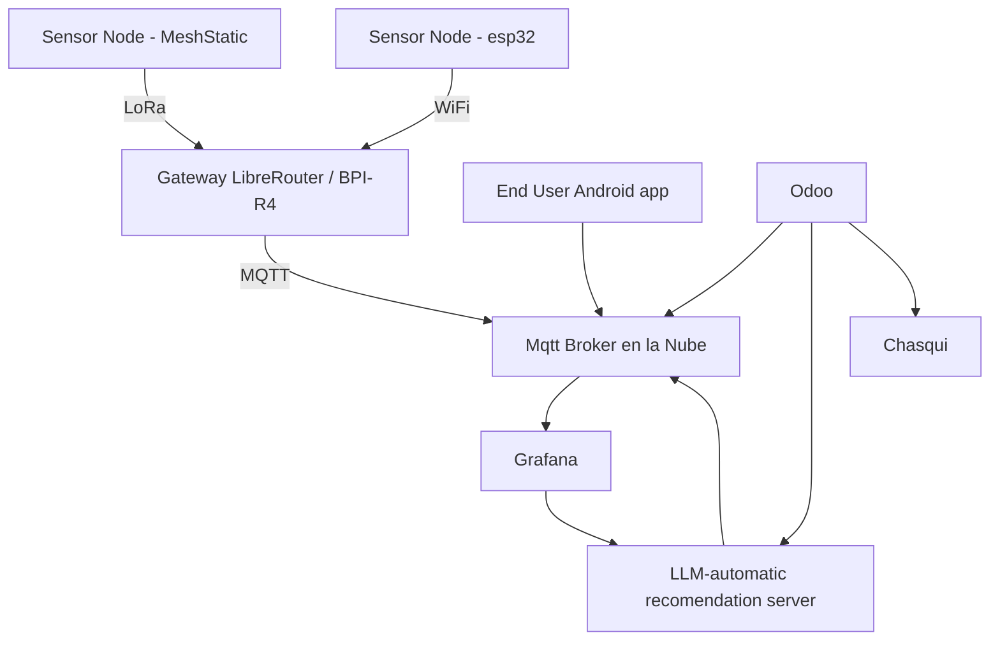

# Ecosistema informático para la agricultura familiar

Una arquitectura IoT para Zonas Rurales con Libremesh y MeshStatic (LoRa)

## Objetivo

Diseñar una arquitectura de hardware y software para redes de sensores IoT en zonas rurales con vegetación densa, utilizando tecnologías de bajo consumo y largo alcance como LoRa, y conectividad comunitaria basada en Libremesh y LibreRouter.

---

## Componentes Principales

### 1. Nodo IoT medición o actuación

### 1.a Sensor Node - MeshStatic

**Hardware:**

* Microcontrolador: ESP32
* Módulo LoRa: SX1278 (433 MHz) o SX1262 (868 MHz) sería preferible la radio de 433 pues podria tener mas potencial de alcance y penetración.&#x20;
* Sensores: temperatura, humedad, CO₂, humedad del suelo, etc.
* Actuadores: relays y triac para controlar luces, ventilación y calefacción
* Fuente de energía: 220/110, (batería recargable + panel solar opcional)
* Antena: Yagi o colineal externa (alta ganancia)

**Software:**

* Firmware propio (Arduino + meshtatic)
* Transmisión y recepción de datos vía LoRa/wifi&#x20;

### 1.b Sensor Node - ESP32 Now

**Hardware:**

* Microcontrolador: ESP32 en placa olivia control&#x20;

**Software:**

* Firmware propio (Arduino + meshtatic)
* esp now (p2p de expressive)

---

### 2. Gateway Rural (LibreRouter + LoRa USB o MESHSTICK)

**Hardware:**

* LibreRouter (OpenWrt/Libremesh)
* Opciones de módulo LoRa:

  * USB LoRa (ej. EBYTE, RAK WisLink, SX1262)
  * [MESHSTICK](https://github.com/markbirss/MESHSTICK)
  * [Core1262-868M de Waveshare](https://www.waveshare.com/core1262-868m.htm)
* Alternativa: [Banana Pi BPI-R4 con OpenWrt y Meshtastic](https://forum.openwrt.org/t/meshtastic-running-on-bananapi-bpi-r4-and-openwrt-one/222812)

**Software:**

* OpenWrt
* Libremesh&#x20;
* Broker local: Mosquitto MQTT&#x20;

  * Organización por topicos: `/localidad/nodo/tipo`
  * en puente con broker en la nube
* Script puente:

  * Escucha por serial/USB LoRa
  * Publica en broker local
  * Sincroniza con broker en la nube si hay conexión

---

### 3. Broker MQTT en la Nube

**Software:**

* Mosquitto / EMQX / HiveMQ en VPS
* Organización por topicos: `/localidad/nodo/tipo`
* Conexión segura vía TLS
* Los miembros de cada localidad pueden suscribirse a sus datos

---

### 4. Cliente de Datos + Visualización

**Software:**

* Cliente MQTT (Python con `paho-mqtt` o ZeroMQ client)
* Base de datos: InfluxDB o TimescaleDB
* Visualización: Grafana
* Alertas opcionales vía Telegram/Email (Node-RED)

---

## Diagrama General

---

## Alternativas y Opcionales

* Uso de ZeroMQ en vez de MQTT o en combinación con. ZeroMq parece tener la posiblidad de funcionar p2p.
* Heartbeat del nodo
* Seguridad: TLS, certificados, autenticación, en especial para enviar comandos.&#x20;
* Gateway con watchdog y logging

---

## Pendientes

* Costos estimados por nodo y por gateway
